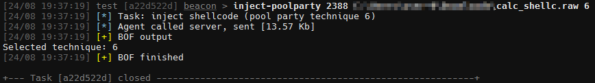

# PoolParty-BOF

A BOF for each technique discovered by [0xDeku](https://github.com/0xDeku)@[SafeBreach-Labs](https://github.com/SafeBreach-Labs), to abuse Windows Thread Pools.

## Usage

```
inject-poolparty <PID> <raw shellcode file path> <technique number>
```


Please note that for obvious reasons no evasion techniques were implemented, except of no `RWX` memory allocations, randomized names and minimal disk footprint.\
<br>
You can find the source of every technique in the respective header file and customize the code as desired. All functions, structs and enums are defined in the `PoolParty.h` header file. 

## Original Research
- https://www.blackhat.com/eu-23/briefings/schedule/#the-pool-party-you-will-never-forget-new-process-injection-techniques-using-windows-thread-pools-35446
- https://github.com/SafeBreach-Labs/PoolParty
